# Практическое занятие №5

## Часть 1

### Doctest

Для задачи 1:

* Установление по сторонам (a, b, c) треугольника его типа: равносторонний, разносторонний, равнобедренный.

Команда запуска Doctest:

```shell
python3 -m doctest -v doctest/doctest_example.py
```

Вывод:

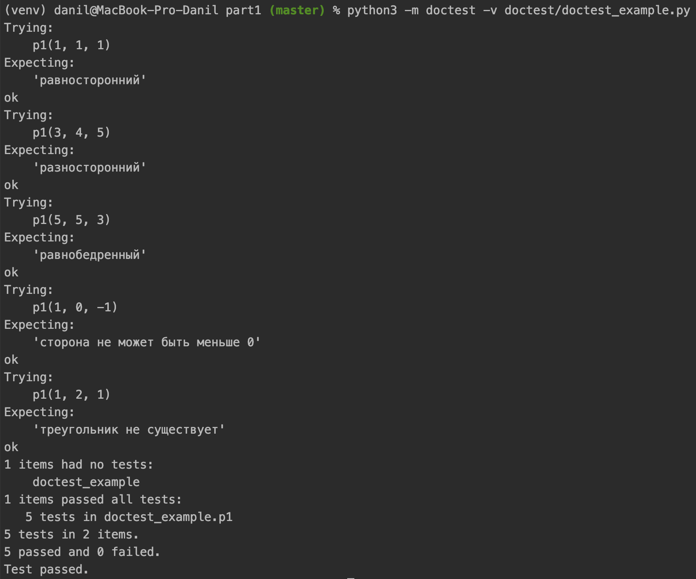

### Pytest

Для задачи 2 и 3:

* Функция проверки пароля на безопасность (например: безопасный пароль содержит комбинирование шести или больше строчных и прописных букв, плюс знаки препинания и цифры).
* Проверка IPv4-адреса на корректность.

Команда запуска Pytest:

```shell
python3 -m doctest -v doctest/doctest_example.py
```

Вывод:

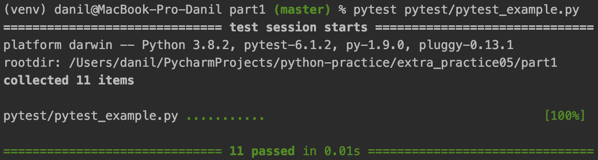

### Coverage

Для задачи 4:

* Реализация структуры данных циклический буфер.

Команда получения статистики по покрытию ветвей:

```shell
pytest coverage/coverage_example.py --cov=. --cov-branch
```

Вывод:

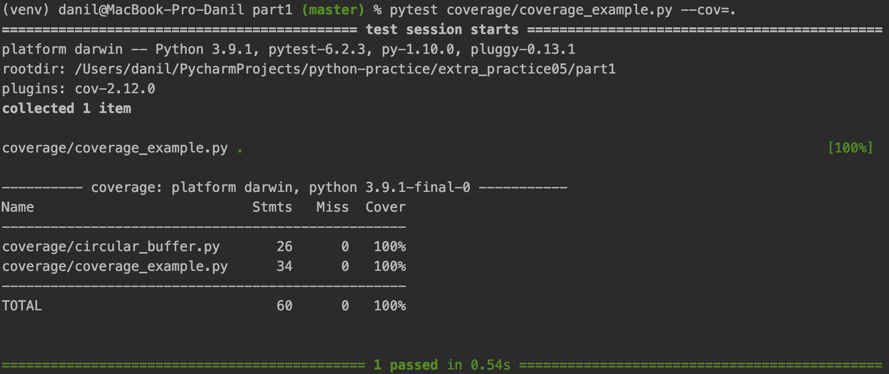

Изменение теста для затруднения получения 100% покрытия:

```python
def test_circular_buffer():
    tests = 0
    buffer_size = 100
    ...
```

Вывод:

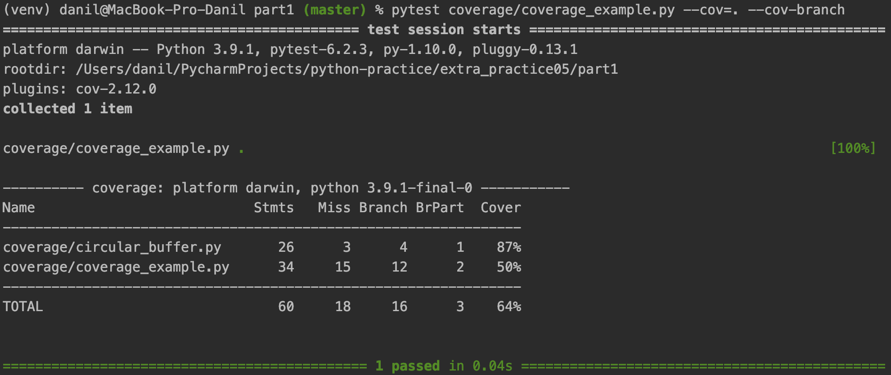

Команда вывода статистики о покрытии в HTML-представлении:

```shell
pytest coverage/coverage_example.py --cov=. --cov-branch --cov-report=html
```

Сгенерированные файлы:

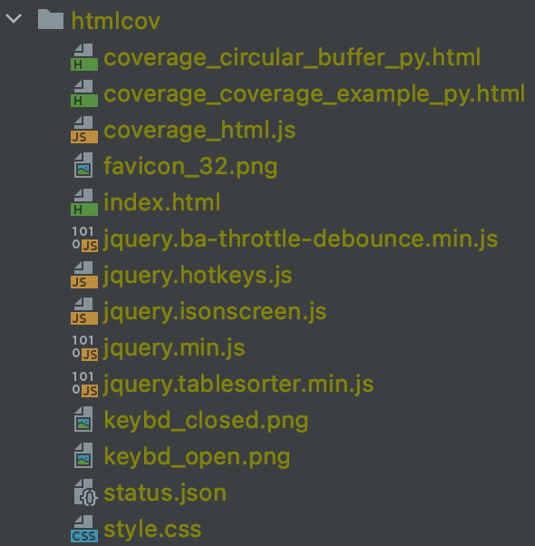

Вывод:

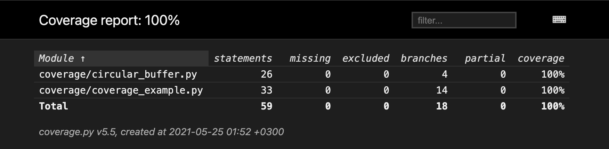

### Mutmut

Для задач:

* Вычисление угола между часовой и минутной стрелками в аналоговых часах.

Команда для просмотра покрытия ветвей:

```shell
pytest mutmut/test_angle.py --cov=. --cov-branch
```

Демонстрация 100% покрытия ветвей:

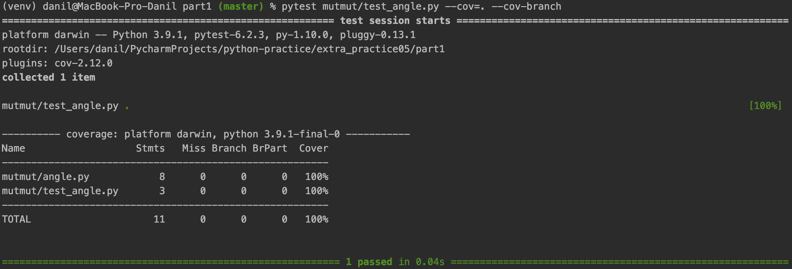

Команда для проверки наличия наличия мутантов:

```shell
mutmut run --paths-to-mutate mutmut/angle.py
```

Демонстрация наличия мутантов:

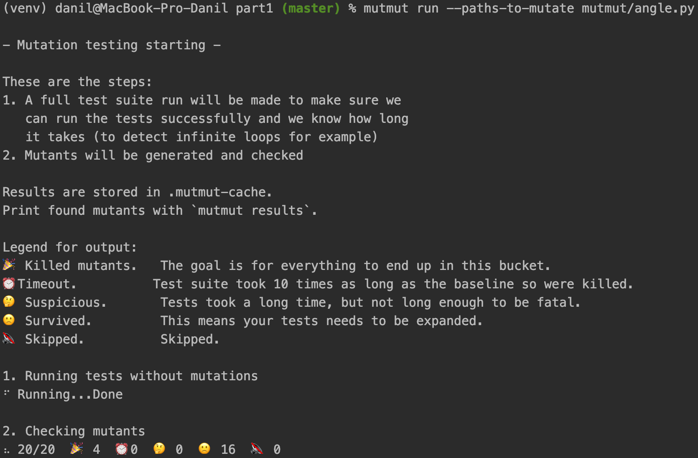

* Транслятор, который удаляет HTML-теги и оставляет обычный текст.

Команда для проверки наличия наличия мутантов:

```shell
mutmut run --paths-to-mutate mutmut/html_delete.py
```

Демонстрация отсутствия мутантов:

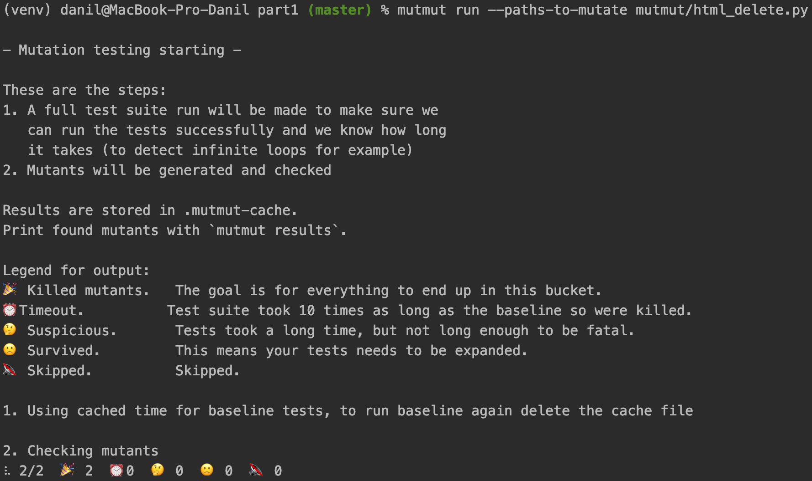

### Deal

Для задач:

* Функция, проверяющая, является ли число степенью двойки.

Добавлены к программе контракты pre, post, ensure, raises, reason.

Команда запуска Deal:

```shell
pytest deal/test_pow_two.py
```

* Реализация структуры данных циклический буфер.

Для класса был добавлен инвариант inv:

```python
import deal


@deal.inv(lambda buffer: buffer.max_size > 0)
class CircularBuffer:
    """
    Реализация структуры данных циклический буфер.
    """
    def __init__(self, max_size=10):
        self.max_size = max_size
        self.__data = [None] * max_size
        self.head = 0
        self.tail = -1

    ...
```

Пример нарушения контракта:
```python
from extra_practice05.part1.coverage.circular_buffer import CircularBuffer

cb = CircularBuffer(-1)
```

Команда запуска Deal:

```shell
pytest coverage/circular_buffer.py
```

Вывод при нарушении контракта:

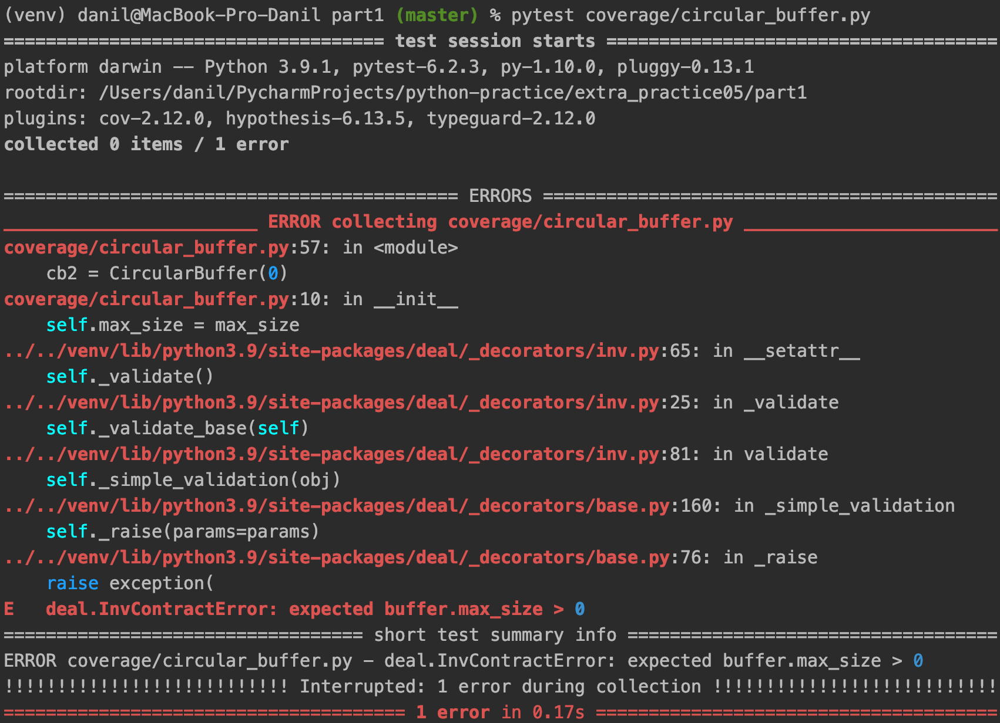

### Hypothesis

Для задачи:

* Протестировать инварианты функций работы над деревьями (такие функции, например, как нахождение высоты, поиска элемента по ключу и так далее).
  Научиться генерировать случайные бинарные деревья с помощью hypothesis.

Случайно сгенерированные деревья:

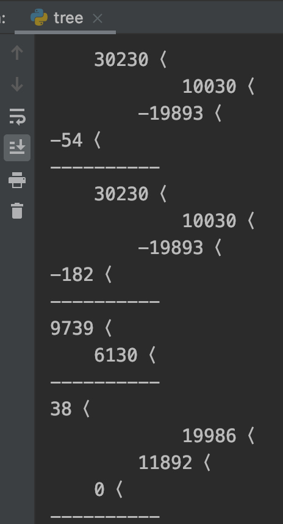

Команда запуска:

```shell
pytest hypothesis/tree.py
```

Вывод:

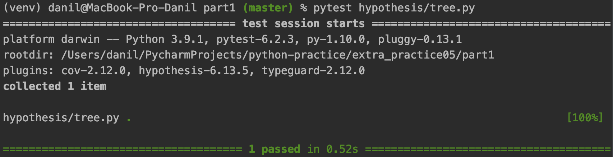
