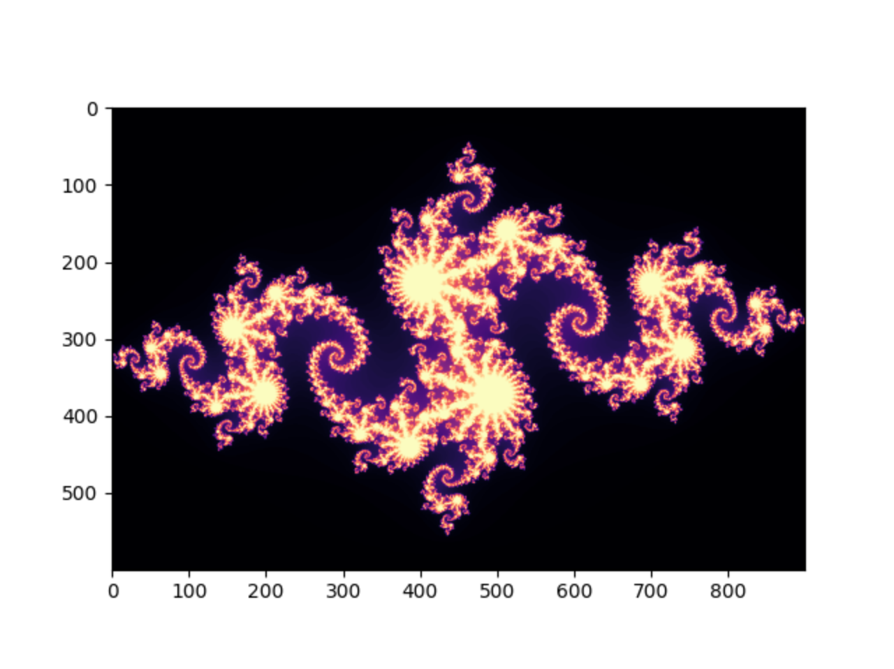
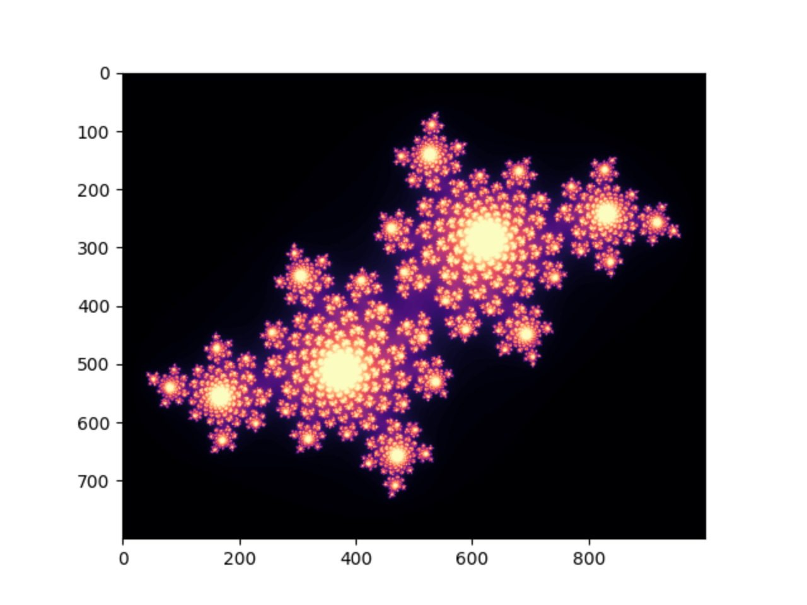
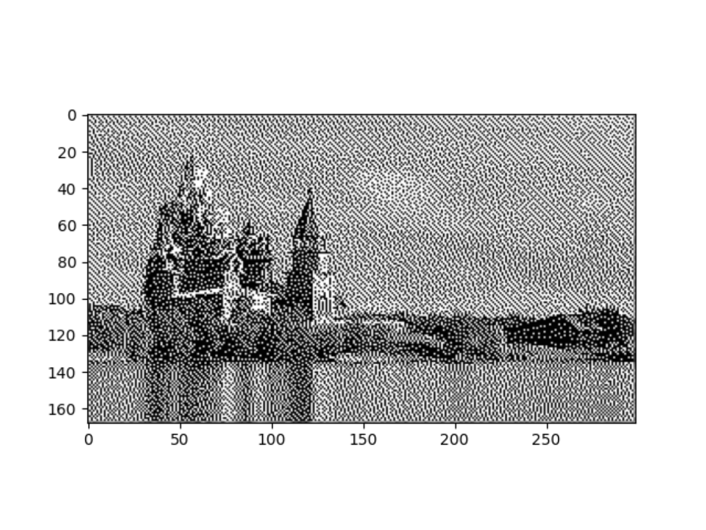

# Практическое занятие №6

## Часть 2

### Изобразите фрактал Жюлиа.

Результаты:

* c = -0.8 + 0.156i, iterations = 150

* c = -0.4 + 0.6i, iterations = 100

### Реализуйте алгоритм Флойда-Стейнберга с помощью NumPy.

Исходный файл:

Результат:

